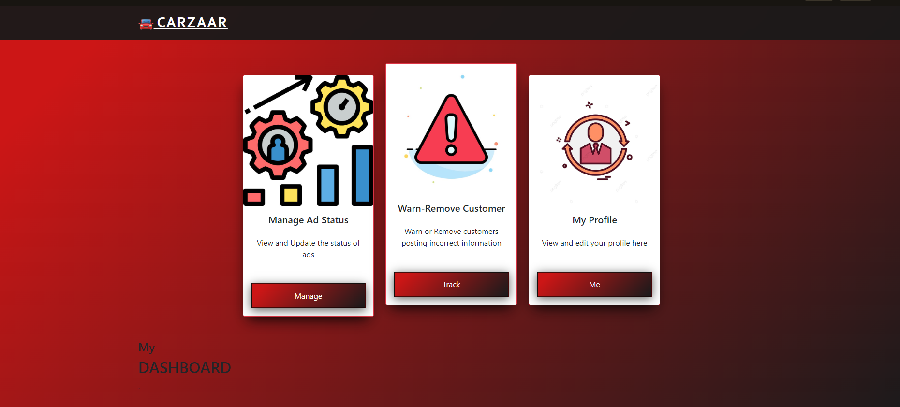

# CarZaar [Automobile Management System]

## Problem Statement
* Vehicle sale or purchase, is a challenge in the 21st century. Physically visiting showrooms and individual sellers is a hectic task to do. 
* Miscommunication between buyers and customers, security concerns, frauds, are some of the major issues.

## Introduction
* A good solution to this challenge is to provide an organized online platform where the user can access all the vehicles at one point.
* Our proposed system is an online automobile sale management website on which users can sell and purchase vehicles in a secure and organized manner by exploring and posting ads of their vehicles.
 
## Key Features
* The system will initially allow the user to access it through login system to ensure security. 
* It will offer the customers to use two features; posting ad of their vehicles to sell or searching for desired vehicles to buy. 
* Apart from this, an admin will be registered in the system to review user activity and manage the posted ads.

## Security
In order to make the system more secure and robust, SQL injection prevention techniques were applied to the system to prevent:
* Unauthorized access to the system
* Loss or deletion of confidential data
* Compromise of individual machines or networks

In every query present in the system files a few steps to prevent SQL injection is applied to ensure the authenticity and integrity of the system.
The steps for SQL injection prevention are as follows:
* Input validation.
  One of the most important factor for SQL injection prevention is input validation as no developer can be sure as to exactly what type of input the
  user will provide, therefore to prevent unwanted manipulation or system crashes, the developer has to make sure that the right input is provided for any field.
* Prepared statements.
  Prepared statements are a way to make database queries execute more safely and reliably. The idea is that instead of sending the raw query to the database,
  we first tell the database the structure of the query we’ll be sending.
* Parametrized query.
  Once a statement is prepared, we pass the information as parametrized inputs so that the database can “fill the gaps” by plugging in the inputs to the query
  structure we sent before. This takes away any special power the inputs might have, causing them to be treated as mere variables or payloads in the entire process.
* Execute and Fetch.
  Rather than executing the query by sending it directly to database we use the execute function in php to make sure the query is properly executed. And for further
  use of the result of the query we use the fetch function to get necessary details.

### Homepage
  

### Signup
  

### Login

### Admin Dashboard

### User Dashboard

This system has been implemented using LAMP stack
In order to run this project, you'll need to XAMP to run phpMyAdmin and Apache for a server to host the site on.
You must import the database into phpMyAdmin with the following details:
* Name the database 'se_project' without the inverted commas.
* Use the appropriate username and password for your system (default is often 'root' and '', without the inverted commas)
