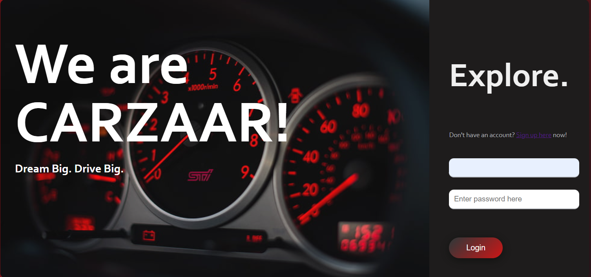

# CarZaar [Automobile Management System]

## Problem Statement
* Vehicle sale or purchase, is a challenge in the 21st century. Physically visiting showrooms and individual sellers is a hectic task to do. 
* Miscommunication between buyers and customers, security concerns, frauds, are some of the major issues.

## Introduction
* A good solution to this challenge is to provide an organized online platform where the user can access all the vehicles at one point.
* Our proposed system is an online automobile sale management website on which users can sell and purchase vehicles in a secure and organized manner by exploring and posting ads of their vehicles.

## Key Features
* The system will initially allow the user to access it through login system to ensure security. 
* It will offer the customers to use two features; posting ad of their vehicles to sell or searching for desired vehicles to buy. 
* Apart from this, an admin will be registered in the system to review user activity and manage the posted ads.

### Homepage
  

### Signup
  

### Login

### Admin Dashboard

### User Dashboard

This system has been implemented using LAMP stack
In order to run this project, you'll need to XAMP to run phpMyAdmin and Apache for a server to host the site on.
You must import the database into phpMyAdmin with the following details:
* Name the database 'se_project' without the inverted commas.
* Use the appropriate username and password for your system (default is often 'root' and '', without the inverted commas)
